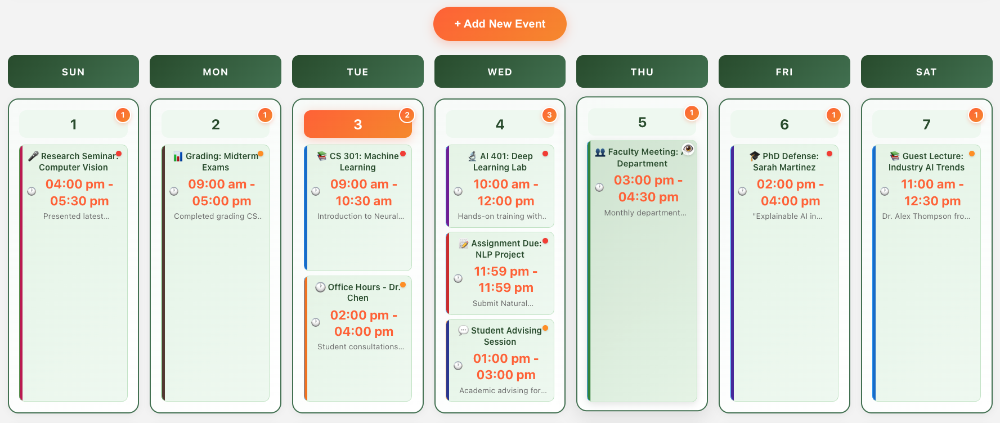

# Redwood Digital University Calendar System

A comprehensive academic calendar system powered by CanopyAI, featuring a Python FastAPI backend, React frontend, and Model Context Protocol (MCP) server for AI agent integration.

## 🎓 Overview

This repository contains a complete university calendar management system designed for **Redwood Digital University**. The system includes:

- **📚 Academic Calendar Backend** - FastAPI-based REST API for calendar management
- **🎨 Modern Web Frontend** - React-based user interface with beautiful design
- **🤖 MCP Server Integration** - AI agent integration via Model Context Protocol
- **🗄️ SQLite Database** - Lightweight database for development and testing



### 🤖 What is the MCP Server?

The **Model Context Protocol (MCP) Server** allows AI agents to interact with your calendar using natural language. Instead of manually clicking through the web interface, you can simply ask an AI assistant:

- *"Show me all my lectures this week"*
- *"Create a meeting with Dr. Smith tomorrow at 2 PM"*
- *"What assignments are due next Monday?"*
- *"Update my office hours to completed status"*

The MCP server translates these natural language requests into calendar operations, making it easy for AI agents to help manage your academic schedule.

## 🏗️ Architecture

```
┌─────────────────────┐    ┌─────────────────────┐    ┌─────────────────────┐
│   React Frontend    │    │   FastAPI Backend   │    │   MCP Server        │
│   (Port 3000)       │◄──►│   (Port 8000)       │◄──►│   (AI Integration)  │
│                     │    │                     │    │                     │
│ • Modern UI         │    │ • REST API          │    │ • 9 Calendar Tools  │
│ • Event Management  │    │ • SQLite Database   │    │ • Natural Language  │
│ • Calendar Views    │    │ • CRUD Operations   │    │ • AI Agent Access   │
└─────────────────────┘    └─────────────────────┘    └─────────────────────┘
```

## 🎯 Features

### 📚 Academic Calendar Backend
- **Event Management** - Create, read, update, delete academic events
- **Category Support** - Lectures, Labs, Meetings, Office Hours, Assignments, etc.
- **Priority Levels** - Low, Medium, High priority classification
- **Status Tracking** - Not Started, In Progress, Completed
- **University Data** - Sample Redwood Digital University events

### 🎨 Modern Web Frontend
- **Beautiful UI** - Modern design with university branding
- **Interactive Calendar** - Monthly view with event details
- **Event Modal** - Detailed event information popup
- **Event Creation** - User-friendly form for new events
- **Responsive Design** - Works on desktop, tablet, and mobile
- **Click-to-View** - Click events to see full details

### 🤖 MCP Server (AI Integration)
- **9 Specialized Tools** for AI agents:
  1. `get_all_events` - List all events with filtering
  2. `get_event` - Get specific event details
  3. `create_event` - Create new academic events
  4. `update_event` - Modify existing events
  5. `delete_event` - Remove events
  6. `get_upcoming_events` - View upcoming events
  7. `get_events_by_date` - Events for specific date
  8. `search_events` - Search by name/content
  9. `get_calendar_statistics` - Calendar analytics

## 🎓 University Integration

**Redwood Digital University** features:
- University branding with CanopyAI system logo
- Academic event categories and workflows
- Sample data with realistic university schedules
- Faculty, student, and administrative events

## 🔧 API Endpoints

### Calendar API (Port 8000)
```
GET    /                     - API status
GET    /schedules           - Get all events
GET    /schedules/{id}      - Get specific event
POST   /schedules           - Create new event
PUT    /schedules/{id}      - Update event
DELETE /schedules/{id}      - Delete event
```

## 🤖 AI Agent Usage

The MCP server enables natural language interaction with the calendar:

```
"Show me all upcoming lectures this week"
"Create a CS 301 lab session for Friday at 2 PM"
"What events are scheduled for tomorrow?"
"Update the ML assignment to completed status"
"Search for all events related to AI"
"Show me calendar statistics for this month"
```

## 🐳 Container Deployment

### Build Images
```bash
# Calendar API
cd calendar-api
podman build -t calendar-api:latest .

# MCP Server
cd calendar-mcp-server
podman build -t calendar-mcp-server:latest .
```

### Run with Podman/Docker
```bash
# Start API
podman run -p 8000:8000 calendar-api:latest

# Start MCP Server
podman run -e CALENDAR_API_BASE_URL="http://calendar-api:8000" calendar-mcp-server:latest
```

## 📊 Database Schema

**Events Table:**
- `sid` (TEXT) - Unique event identifier
- `name` (TEXT) - Event name/title
- `content` (TEXT) - Event description
- `category` (TEXT) - Event type (Lecture, Lab, etc.)
- `level` (INTEGER) - Priority level (1-3)
- `status` (REAL) - Completion status (0.0-1.0)
- `creation_time` (TEXT) - When event was created
- `start_time` (TEXT) - Event start time
- `end_time` (TEXT) - Event end time

## 🎨 Screenshots

- **Calendar View** - Monthly grid with events
- **Event Details** - Popup modal with full information
- **Event Creation** - Form for adding new events
- **University Branding** - Redwood Digital University theme
